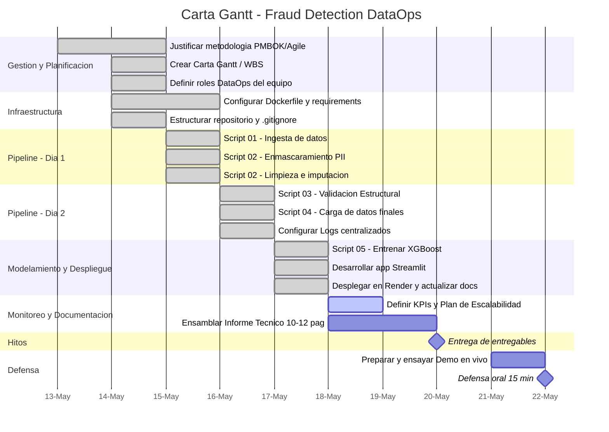

## Carta Gantt (PMBOK/WBS)

Cronograma del proyecto con metodologia hibrida PMBOK/Agile (17 tareas atomicas WBS).

## Agrupacion de tareas por dia

| Dia | Tareas |
|-----|--------|
| 13-14 May | Gestion PMBOK, Carta Gantt, Roles, Dockerfile, Repositorio |
| 15 May | Script 01, Script 02 (Enmascaramiento + Limpieza) |
| 16 May | Script 03, Script 04, Logs centralizados |
| 17 May | Script 05 (XGBoost), Streamlit, Deploy Render |
| 18-19 May | KPIs, Informe Tecnico |
| 20 May | **Entrega** |
| 21 May | Ensayo Demo |
| 22 May | **Defensa oral** |
